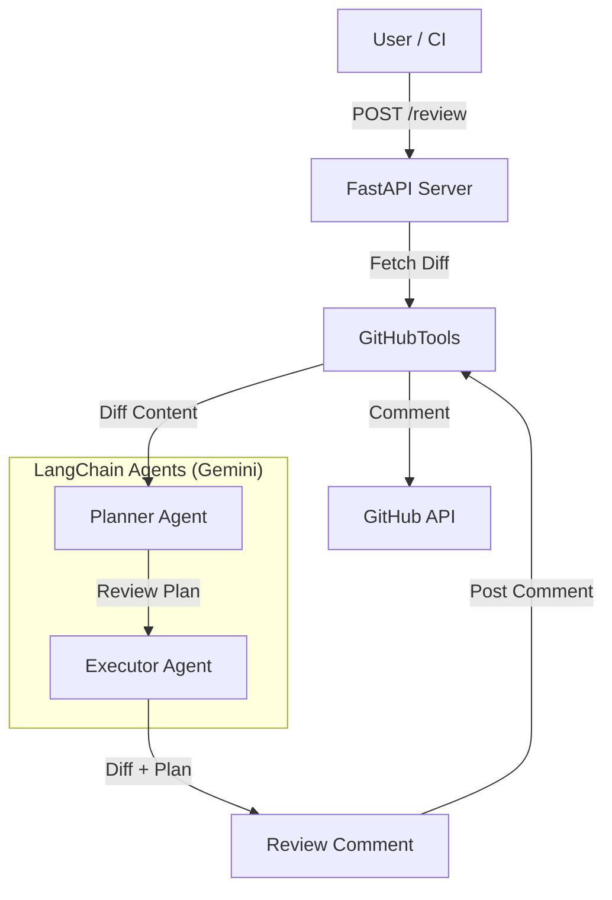

# GitHub PR Review Agent

An AI-powered agent that automates GitHub Pull Request reviews using Google Gemini. It analyzes PR diffs, plans a review strategy, and posts constructive comments back to GitHub.

## Architecture

The system follows a multi-agent architecture:



### Components
- **FastAPI Server (`app.py`)**: Entry point for triggering reviews. It accepts configuration for language and output length.
- **GitHubTools (`github_tools.py`)**: Handles interactions with the GitHub API (fetching diffs, posting comments).
- **Planner Agent (`agents.py`)**: Analyzes the raw diff and creates a high-level review plan (e.g., "Check for security vulnerabilities", "Verify error handling").
- **Executor Agent (`agents.py`)**: Takes the plan and the diff to generate the final detailed review comment in Markdown format.

## Setup

### Prerequisites
- Python 3.9+
- A GitHub Personal Access Token (PAT) with repo access.
- A Google Cloud API Key for Gemini.

### Installation

1. **Clone the repository:**
   ```bash
   git clone <repo-url>
   cd github_pr_agent
   ```

2. **Create and activate a virtual environment:**
   ```bash
   python3 -m venv venv
   source venv/bin/activate
   ```

3. **Install dependencies:**
   ```bash
   pip install -r requirements.txt
   ```

4. **Environment Configuration:**
   Copy `.env.example` to `.env` and fill in your keys:
   ```bash
   cp .env.example .env
   ```
   
   Edit `.env`:
   ```env
   GITHUB_TOKEN=your_github_pat_here
   GOOGLE_API_KEY=your_google_api_key_here
   ```

## Usage

### Running the Server
Start the API server:
```bash
./venv/bin/uvicorn app:app --reload
```
The server will start at `http://127.0.0.1:8000`.

### Triggering a Review
You can trigger a review using `curl`.

**Parameters:**
- `repo` (string, required): Format "owner/repo".
- `pr_number` (int, required): The PR number.
- `dry_run` (bool, optional): If true, does not post to GitHub. Default: `false`.
- `language` (string, optional): Output language for the review. Default: `"pt-BR"`.
- `max_tokens` (int, optional): Max tokens for the Gemini response. Default: `2000`.

**Example: Dry Run in Portuguese (Default)**
```bash
curl -X POST "http://127.0.0.1:8000/review" \
     -H "Content-Type: application/json" \
     -d '{
           "repo": "owner/repo_name",
           "pr_number": 123,
           "dry_run": true
         }'
```

**Example: Review in English with Token Limit**
```bash
curl -X POST "http://127.0.0.1:8000/review" \
     -H "Content-Type: application/json" \
     -d '{
           "repo": "owner/repo_name",
           "pr_number": 123,
           "language": "en-US",
           "max_tokens": 1000
         }'
```

### Example Output

```json
{
  "status": "success",
  "plan": "## Plano de Revisão\n\n1. Analisar as mudanças em `auth.py` quanto a falhas de segurança.\n2. Verificar a nova dependência...",
  "review": "## Sumário\n\nEste PR introduz autenticação OAuth...\n\n## Code Review\n\n### src/auth.py\n- **Segurança**: O tratamento do token na linha 45 parece correto...",
  "github_response": "Comment posted successfully."
}
```

## API Documentation
Once the server is running, visit `http://127.0.0.1:8000/docs` for the interactive Swagger UI.
